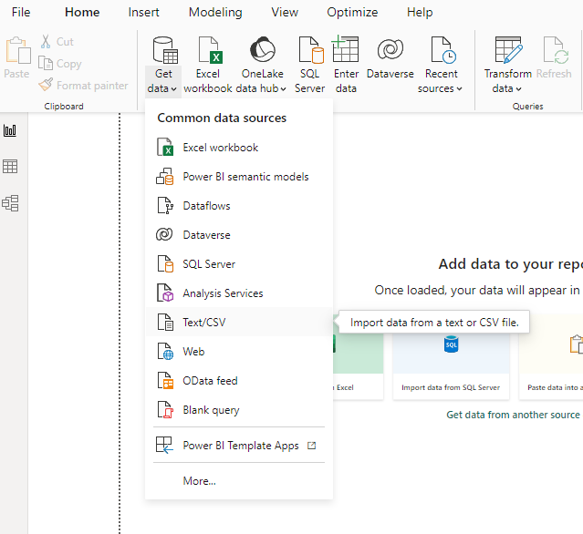
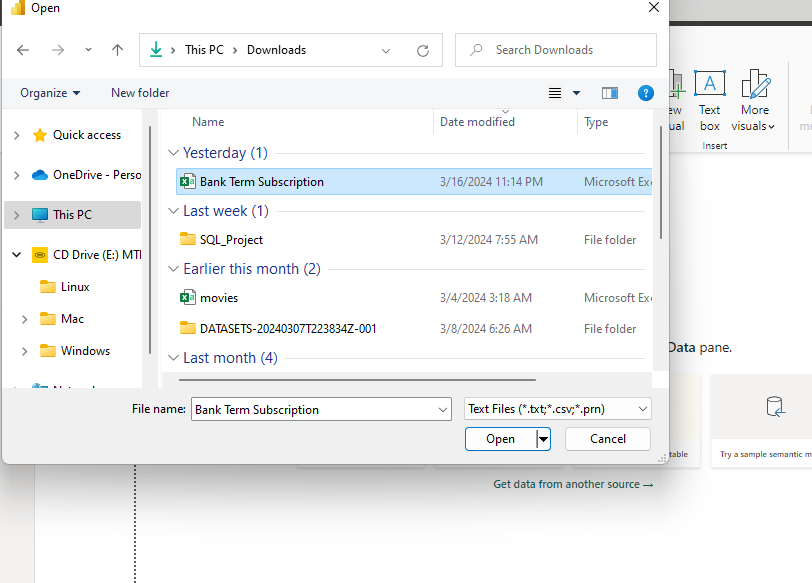
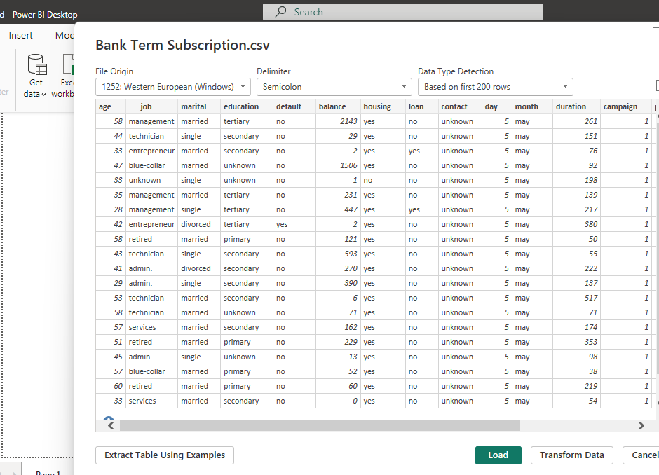
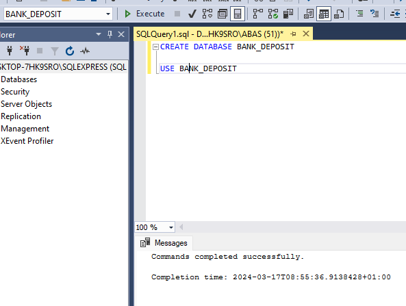
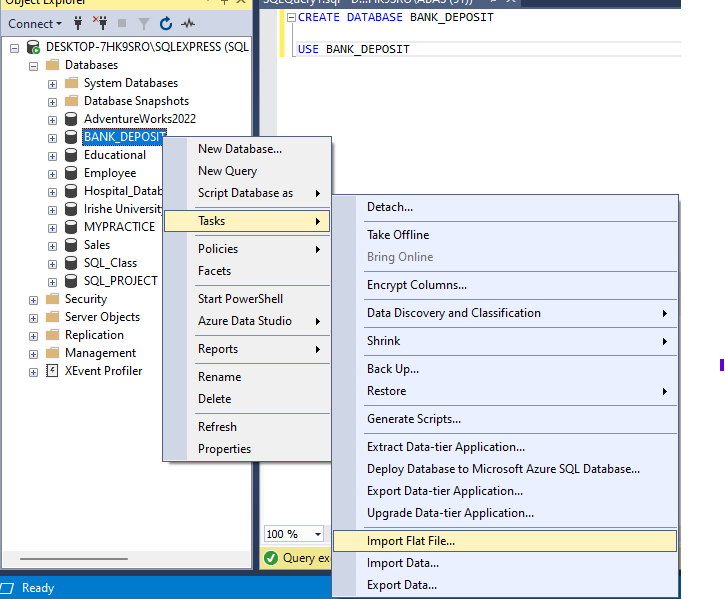
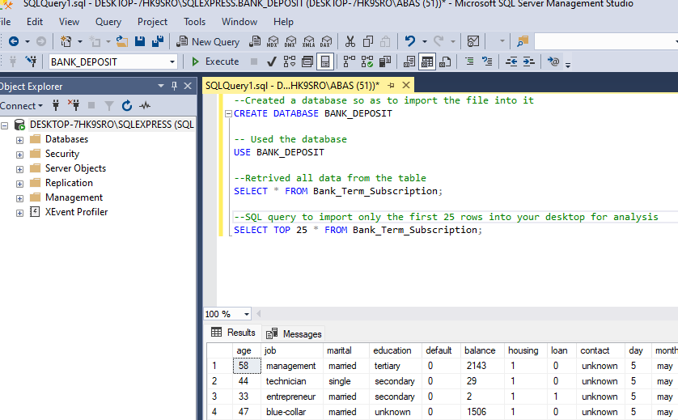
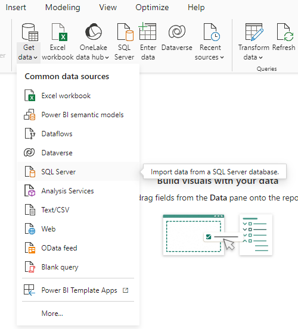
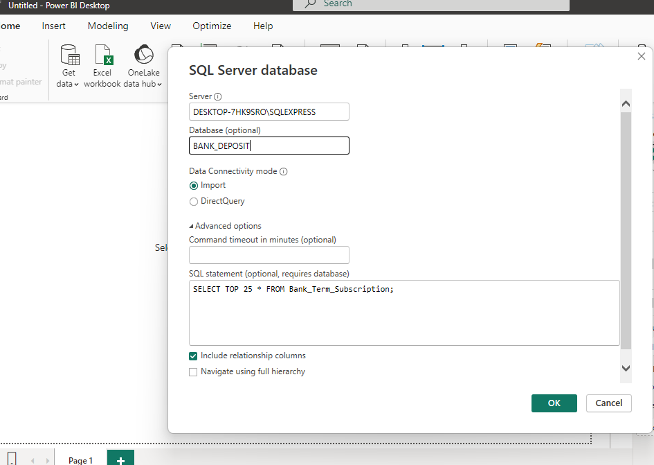
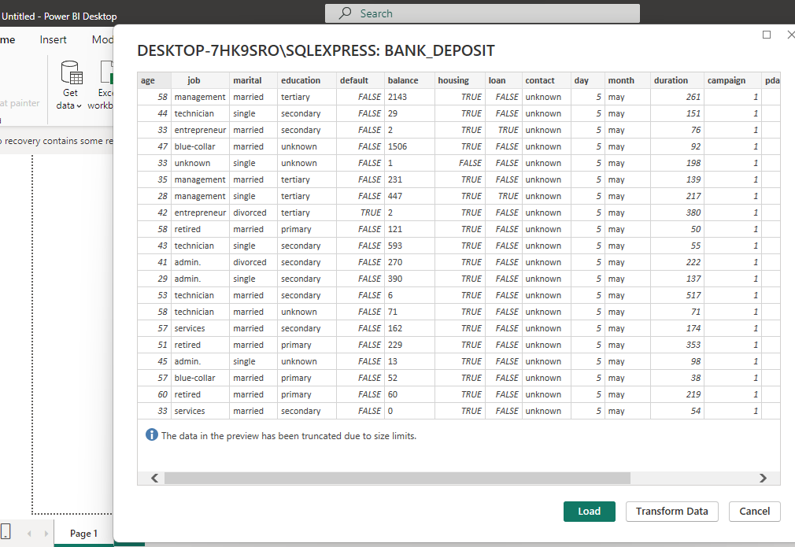
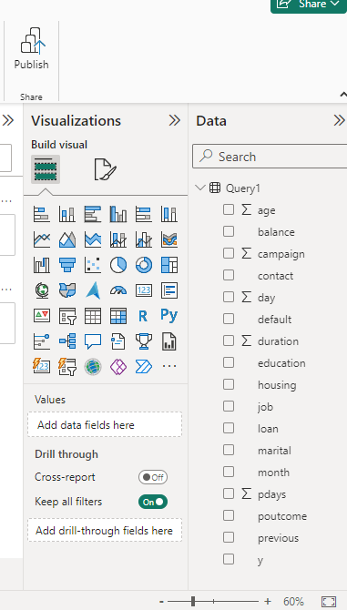

# Importing Bank Term Deposit Subscription Dataset into Power BI Desktop

## Introduction:
This work provides step-by-step instructions on importing data into Power BI Desktop. Two Methods will be applied here:

1. Importing a CSV dataset:
   Here, I used a sample dataset named "Bank Term Deposit Subscription" stored in CSV format. This file is already downloaded into my local machine.
   
2. Connecting to an SQL database using a custom SQL query: In this section, I will be using SQL query to import data into Power BI.

## Problem Statement:
1. Import the ‘Bank Term Deposit Subscription’ dataset into your Power BI Desktop using the csv file option
2. Load the dataset into a database in SQL Server, connect your Power BI desktop to this database and import only the first 25 rows into your desktop for analysis


## Importing a CSV dataset: 
-  Open the Power BI Desktop application
-  Access the Get Data Pane which is In the Home ribbon, click on "Get Data", this will open a pane on the right side of the window displaying various data source options.
-  Select Text/CSV: Within the "Get Data" pane, locate the "Text/CSV" option and click on it.

  

 - I navigated to where I downloaded the csv file in my local machine
 - Then I Select the file and click 'Open' to import it into Power BI Desktop.

 

 - After importing the dataset, Power BI shows the preview of the dataset
 - I will either load the data on Power BI or move it Power Query for further transformation



##  Connecting to an SQL database using a custom SQL query:
Here, I demonstrated the process of connecting to an SQL database, importing a dataset, and retrieving specific data using a custom SQL query.

- First, I created a database called "Bank_Deposit" and ensured that the database is used.

*CODE USED:*

 ```
  CREATE DATABASE BANK_DEPOSIT;
  USE BANK_DEPOSIT;
  ```
 
  

 - I imported the "Bank Term Subscription" dataset, which was provided as a CSV file, into the "Bank_Deposit" database.

 

- To ensure the successful import of the dataset, I retrieved all the data from the table.
- After verifying the data, I proceeded to retrieve only the first 25 rows from the dataset

*CODE USED:*
```
SELECT * FROM Bank_Term_Subscription;
SELECT TOP 25 * FROM Bank_Term_Subscription;
```


- I lunched the Power BI Desktop and navigated to the 'Get Data' option to import data from SQL.



- I provided the database name and other information needed to connect to the SQL database.



- It worked! So Power BI Desktop displayed a preview of the imported data.



- Finally, I loaded the data into Power BI.




## *To interact with the project's SQL query, click [here](https://github.com/AbasimaEtim/Importing-Bank-Term-Deposit-Subscription-Dataset-into-Power-BI-Desktop_a_csv_file/blob/main/SQLQueryforimport.sql)*


## The End 😊

